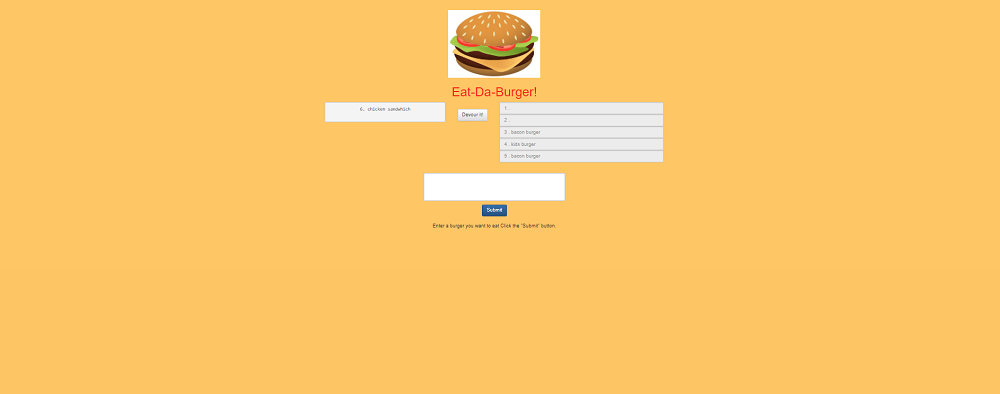

# Eat-Da-Burger
Welcome to the Eat-Da-Burger App.

To run this app, you can clone this repo to your computer, install the npm packages and then run npm start.

This app is made using:
    *html
    *CSS
    *Handlebars
    *NodeJS
    *Javascript
    *mySQL

and this uses the following node packages:
    *body-parser
    *express
    *express-handlebars
    *method-override
    *mySQL

The goal of this app was to simple design a very basic website using handlebars as a design and using mySQL to add objects to a database.

Step 1 of 2:
 Enter a sandwhich in the empty field and press submit
 

 Step 2 of 2:
 Press the submit button to add the burger you previously entered to add it to the database.

